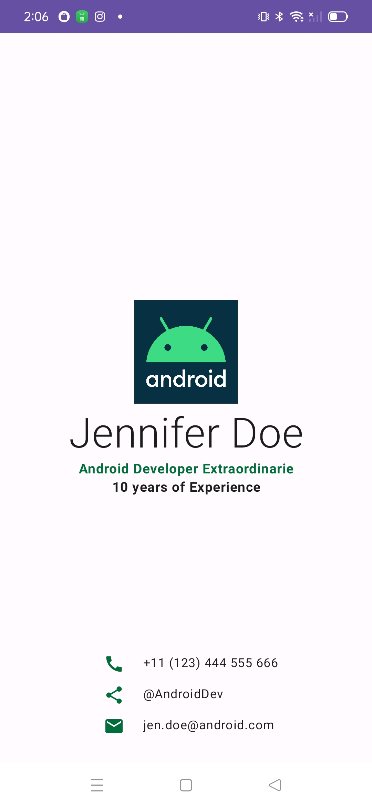

# BusinessCard

A simple business card app built for Android using Kotlin and Jetpack Compose. It demonstrate simple layouts with Row and Column composables, arranged with horizontalAlignment and verticalArrangement parameters. Also shows customization of Compose elements with a Modifier object.

## Features

- Custom Business Card with android logo, your name, title, years of experience, phone number, share link and email address

## Screenshot



## Getting Started

1. Clone the repository ```git clone https://github.com/avanisoam/BusinessCardApp.git```
2. Open the project in Android Studio
3. Build and run the app on an emulator or a device

## Built With

- [Kotlin](https://kotlinlang.org/) - Programming language
- [Jetpack Compose](https://developer.android.com/jetpack/compose) - UI toolkit

## Authors

- **Avani Soam** - [avanisoam](https://github.com/avanisoam)

## License

This project is licensed under the MIT License - see the [LICENSE.md](LICENSE.md) file for details

## Acknowledgments

- Inspired by the [Google Codelab on Android Basics with Compose](https://developer.android.com/courses/android-basics-compose/course)